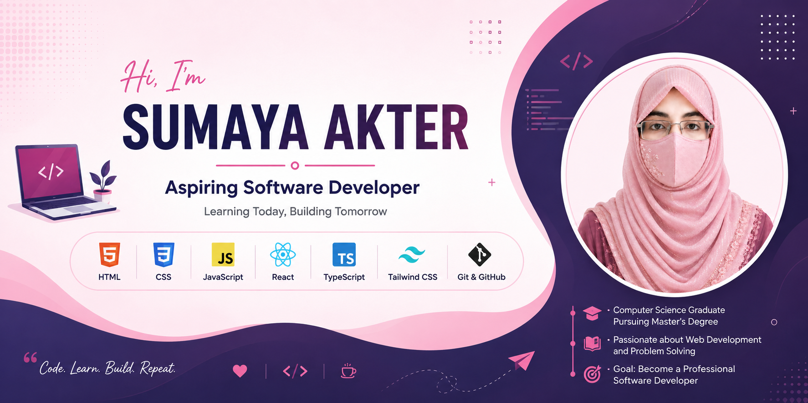

<!-- ===================== Banner ===================== -->

  

<!-- ===================== Introduction ===================== -->

<h1 align="center">Hi 👋, I'm Sumaya Akter</h1>

<h3 align="center">
  Aspiring Software Developer | Web Development Learner
</h3>

  

---

## 👩‍💻 About Me

I'm a Computer Science graduate pursuing a Master's degree and
currently learning **Python and Web Development**.

I'm passionate about building websites, learning modern technologies,
solving programming problems, and improving my development skills.

- 🌱 I’m currently learning **JavaScript, React, TypeScript & Tailwind CSS**
- 💻 I’m exploring **Frontend Web Development**
- 🚀 I’m working on different **Web Development projects**
- 📚 I’m continuously improving my **problem-solving skills**
- 🎯 My goal is to become a **professional Software Developer**

---

## 🛠️ Skills & Technologies

---

<h2 align="center">🌐 Connect With Me</h2>

<!-- GitHub -->

<!-- Facebook -->

<!-- Code Lab (Custom SVG Icon) -->
<a href="https://codelab.serve.bd/u/sumaya-akter935" target="_blank">
<defs><linearGradient id='grad' x1='0%' y1='0%' x2='100%' y2='100%'><stop offset='0%' stop-color='%23d946ef'/><stop offset='100%' stop-color='%23a855f7'/></linearGradient></defs><rect width='100' height='100' rx='22' fill='url(%23grad)'/><path d='M42 32 L25 50 L42 68 M58 32 L75 50 L58 68' stroke='white' stroke-width='7' stroke-linecap='round' stroke-linejoin='round' fill='none'/></svg>" width="45" height="45" alt="Code Lab"/>
</a>

<!-- Email -->

---

## 🔥 GitHub Streak

  

---

## 🎯 2026 Goals

- ✅ Improve JavaScript fundamentals
- 🚀 Learn React deeply
- 📘 Learn TypeScript
- 🎨 Master Tailwind CSS
- ⚛️ Build real-world React projects
- 💼 Become a professional Web Developer

---

### 💙 Thanks for visiting my profile!

⭐ Feel free to explore my repositories and projects.

